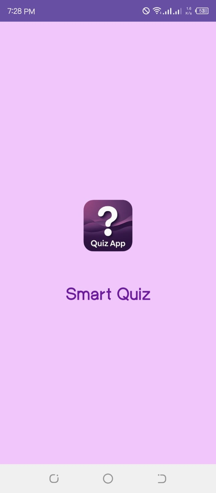
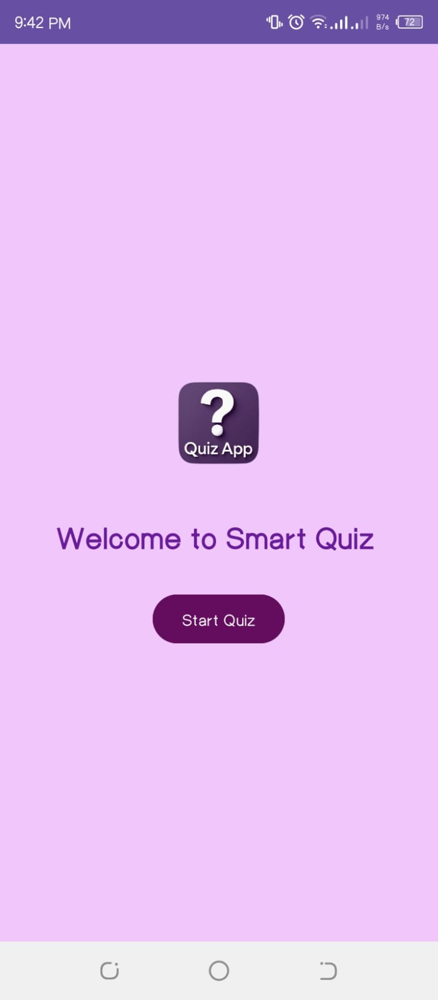
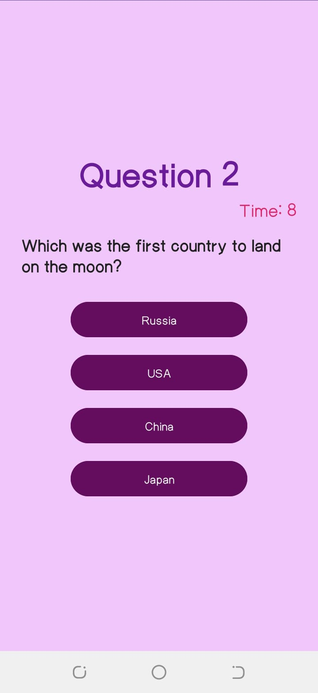
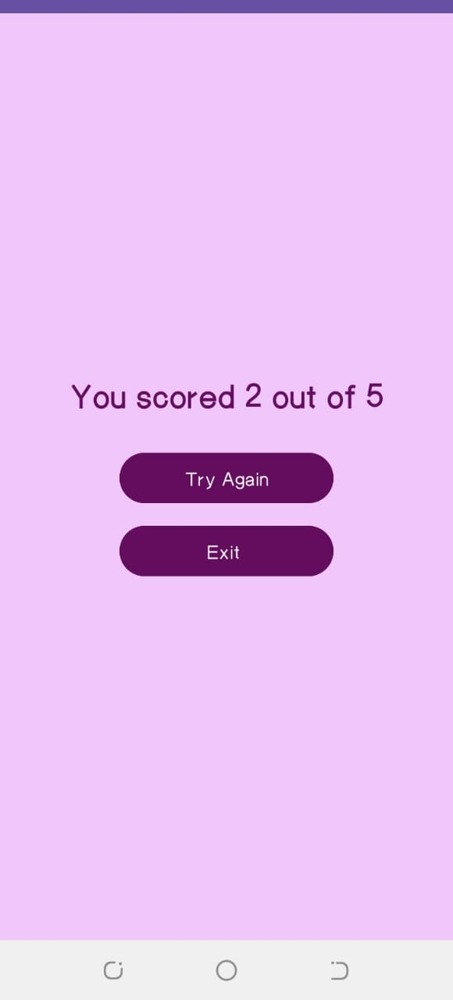

##  Quiz App 🧠📱

This is a simple Android *Quiz App with a splash screen and a 10-second countdown timer, created as part of my internship at **Digital Empowerment Network**.

## 🧩 ***Features***

-✨ *Splash Screen* with app logo animation     

-🏠 *Home Screen* with Start Quiz button  

-❓  5 *Multiple Choice Questions (MCQs)*   

-⏳ *10-second timer* for each question   

-🚀 Auto-skip to next question if time runs out   

-✅ Score screen showing your final result   

-🔁 Restart quiz with *new random questions* every time   

-🚪 Exit option to close the app    

## 🎨 ***Technologies Used***

 -*Java* for logic & backend    
 
 -*XML* for layouts and UI

 -*Android Studio*      
 
 -CountDownTimer for timing       
 
 -State management with Java variables

## 📸 ***Screenshots***

| Splash Screen | Home | Quiz | Result |
|---------------|------|------|--------|
|  |  |  |  |

## ▶️ How to Run the App

1. Clone or Download this repo
2. Open it in *Android Studio*
3. Wait for Gradle to sync
4. Click *Run ▶️* to launch the app

## 🙋‍♀️ Developed By

Ifra Malik  
Intern @ Digital Empowerment Network  
[GitHub Profile](https://github.com/ifra489)
